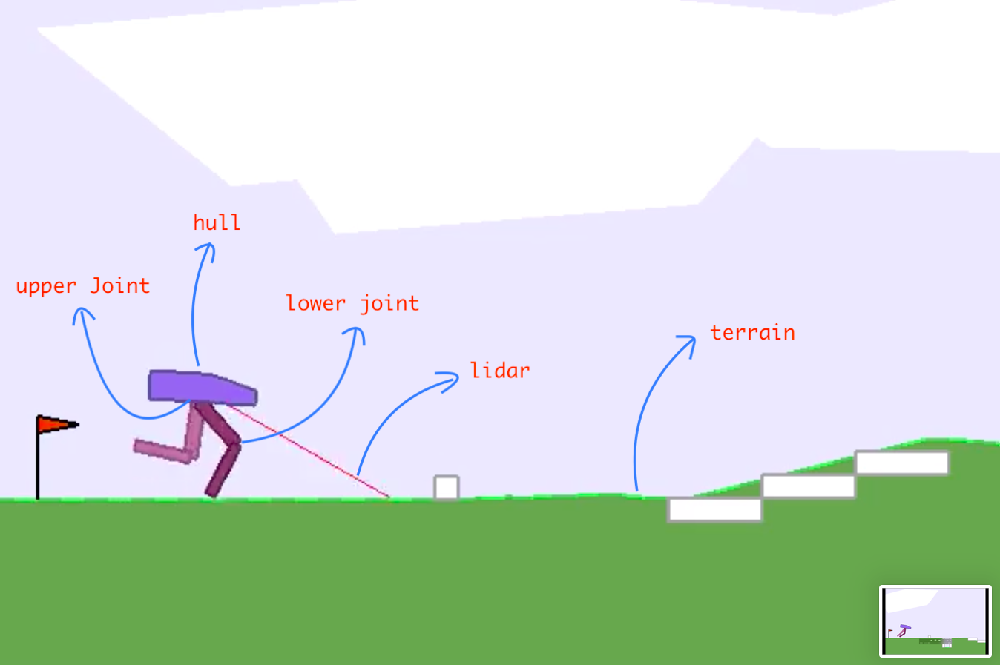
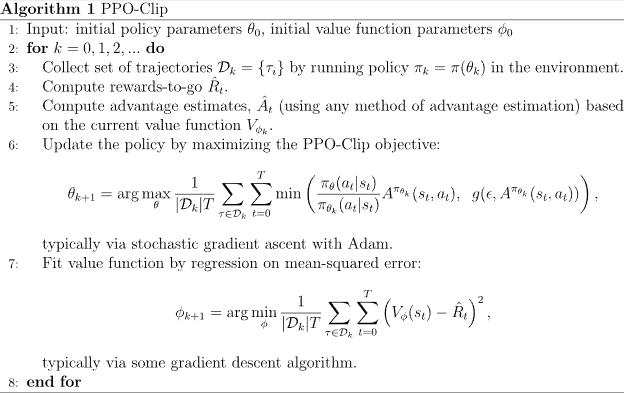
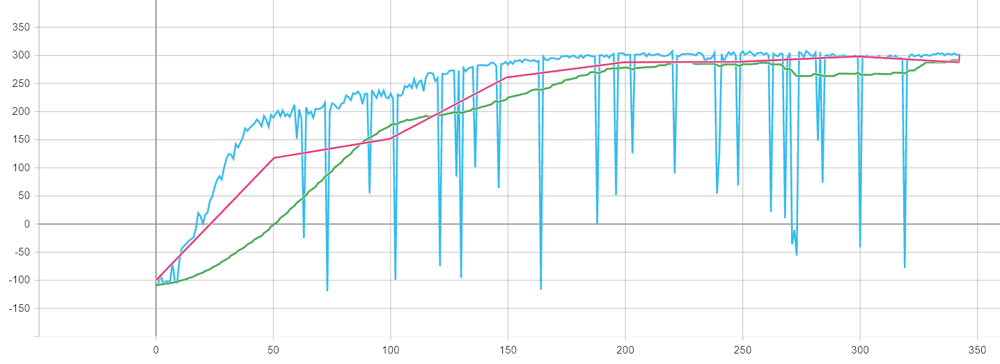

# Proximal Policy Optimization (PPO) algorithm on OpenAI's BipedalWalker

## Summary
&nbsp;&nbsp;&nbsp;&nbsp;The goal of this application is to implement **PPO algorithm**[[paper]](https://arxiv.org/pdf/1707.06347.pdf) on [Open AI BipedalWalker enviroment](https://gym.openai.com/envs/BipedalWalker-v2/).
  
 


*PPO: Episode 8 vs Episode 125 vs Episode 240*

## Environment
&nbsp;&nbsp;&nbsp;&nbsp;[BipedalWalker](https://gym.openai.com/envs/BipedalWalker-v2/) is [OpenAI Box2D enviroment](https://gym.openai.com/envs/#box2d) which corresponds to the simple 4-joints walker robot environment. BipedalWalker enviroment contains the head (hull) and 4 joints that represent 2 legs. Normal version of BipedalWalker has slightly uneven terrain that is randomly generated. The robot moves by applying force to 4 joints. 



*BipedalWalker Enviroment [Image source](https://shiva-verma.medium.com/teach-your-ai-how-to-walk-5ad55fce8bca)*

&nbsp;&nbsp;&nbsp;&nbsp;State consists of hull angle speed, angular velocity, horizontal speed, vertical speed, position of joints and joints angular speed, legs contact with ground, and 10 lidar rangefinder measurements to help to deal with the hardcore version. There's no coordinates in the state vector. Lidar is less useful in normal version, but it works. 

&nbsp;&nbsp;&nbsp;&nbsp;Reward is given for moving forward, total 300+ points up to the far end. If the robot falls, it gets -100. Applying motor torque costs a small amount of points, more optimal agent will get better score. 

&nbsp;&nbsp;&nbsp;&nbsp;There are four continuous actions, each in range from -1 to 1, represent force which will be applied to certain joint.

&nbsp;&nbsp;&nbsp;&nbsp;The episode ends when the robot **comes to the end of the terrain** or episode length is **greater than 500**. Goal is reached when algorithm achieves ***mean score of 300 or higher on last 100 episodes (games)***.

## Proximal Policy Optimization
&nbsp;&nbsp;&nbsp;&nbsp;Proximal Policy Optimization algorithm is advanced [policy gradient method](https://www.davidsilver.uk/wp-content/uploads/2020/03/pg.pdf) which relies upon optimizing parametrized policies with respect to the expected return (long-term cumulative reward) by [gradient descent](https://en.wikipedia.org/wiki/Gradient_descent). The policy is parametrized with neural network, where input is 24x1 vector that represents current state and output is 4x1 vector with means of each action. In this case, two different neural networks were used, one for Policy (which is same as the policy network described previously) and Critic neural network which represents value function whose role is to estimate how good of a choise was an action chosen by Policy NN.

### Algorithm

&nbsp;&nbsp;&nbsp;&nbsp; PPO algorithm is an upgrade to basic Policy Gradient methods like REINFORCE, Actor-Critic and A2C. First problem with basic PG algorithms was collapse in performance due to incorect step size. If step size is too big, policy will change too much, it its bad we wont be able to recover. Second problem is sample inefficiency - we can get more than one gradient step per enviroment sample. PPO solves this using [Trust Regions](https://en.wikipedia.org/wiki/Trust_region) or not allowing for step to becomes too big. Step size will be determened by difference between new (current) policy and old policy we used to collect samples. PPO suggests two ways to handle this solution: [KL Divergence](https://en.wikipedia.org/wiki/Kullback%E2%80%93Leibler_divergence) and Clipped Objective. In this project we used Clipped Objective where we calculated ratio between new and old policy which we clipped to (1-Ɛ, 1+Ɛ). To be pessimistic as possible, minimum was calculated between *ratio * advantage* and *clipped ratio * advantage*.


*PPO algorithm*

## Continuous action implementation
&nbsp;&nbsp;&nbsp;&nbsp;Since BipedalWalker is Continuous Control enviroment with multiple continuous actions we can't use NN to give us action probabilities. Instead NN will output four action means and we will add aditional [PyTorch Parameter](https://pytorch.org/docs/1.9.1/generated/torch.nn.parameter.Parameter.html) without input, which will represent logarithm of standard deviation. Using mean and std we can calculate [Normal distribution](https://en.wikipedia.org/wiki/Normal_distribution) from which can we sample to get actions we want to take.

## Improving PPO
&nbsp;&nbsp;&nbsp;&nbsp; Since basic PPO didn't give satisfactory results, there were several implementational improvements which resultet in better performance. &nbsp;&nbsp;&nbsp;&nbsp; Implemented improvements that are suggested by [Implementation Matters in Deep Policy Gradients: A Case Study on PPO and TRPO *Engstrom et al.*](https://arxiv.org/pdf/2005.12729.pdf):
* Value Function Loss Clipping
* Adam Learning Rate Annealing
* Global Gradient Clipping
* Normalization of Observation and Observation Clipping
* Scaling and Clipping Reward
* Hyperbolic Tangent Activations

&nbsp;&nbsp;&nbsp;&nbsp; Implemented improvements that are suggested by [OpenAI's implementation of PPO algorithm](https://github.com/openai/baselines/tree/ea25b9e8b234e6ee1bca43083f8f3cf974143998/baselines/ppo2):
* Not Sharing Hidden Layers for Policy and Value Functions
* Generalized Advantage Estimation (GAE)
* Normalization of Advantages
* The Epsilon Parameter of Adam Optimizer
* Overall Loss Includes Entropy Loss

## Testing
&nbsp;&nbsp;&nbsp;&nbsp; To get accurate results, algorithm has additional class (test process) whose job is to occasionally test 100 episodes and calculate mean reward of last 100 episodes. By the rules, if test process gets 300 or higher mean score over last 100 games, goal is reached and we should terminate. If goal isn't reached, training process continues. Testing is done every 50 * 2048 steps or when mean of last 40 returns is 300 or more.

## Results
&nbsp;&nbsp;&nbsp;&nbsp;One of the results can be seen on graph below, where X axis represents number of steps in algorithm and Y axis represents episode reward, mean training return and mean test return (return = mean episode reward over last 100 episodes). Keep in mind that for goal to be reached mean test return has to reach 300. Also one step in algorithm is 2048 steps in enviroment.



-  `Episode reward`
-  `Mean training return`
-  `Mean test return`

* During multiple runs, **mean test return is over 300**, therefore we can conclude that **goal is reached!**

&nbsp;&nbsp;&nbsp;&nbsp;Additional statistics

* **Fastest run reached the goal after 700,416 enviroment steps**.
* **Highest reward in a single episode achieved is 320.5**.

## Rest of the data and TensorBoard
&nbsp;&nbsp;&nbsp;&nbsp; If you wish to use trained models, there are saved NN models in [/models](/models). Keep in mind that in that folder you need both `data.json` and `model.p` files (with same date in name) for script `load.py` to work. You will have to modify `load.py` PATH parameters and run the script to see results of training.

&nbsp;&nbsp;&nbsp;&nbsp; **If you dont want to bother with running the script, you can head over to the [YouTube](https://youtu.be/h4JpY4pzwec) or see best recordings in [/recordings](/recordings).**

&nbsp;&nbsp;&nbsp;&nbsp;Rest of the training data can be found at [/content/runs](/content/runs). If you wish to see it and compare it with the rest, I recommend using TensorBoard. After installation simply change the directory where the data is stored, use the following command
  
```python
LOG_DIR = "full\path\to\data"
tensorboard --logdir=LOG_DIR --host=127.0.0.1
```
and open http://localhost:6006 in your browser.
For information about installation and further questions visit [TensorBoard github](https://github.com/tensorflow/tensorboard/blob/master/README.md)
  


